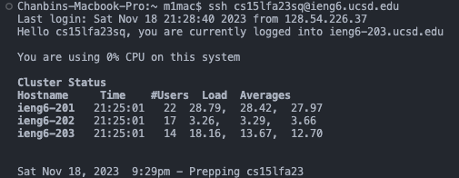
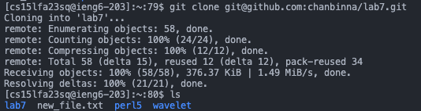
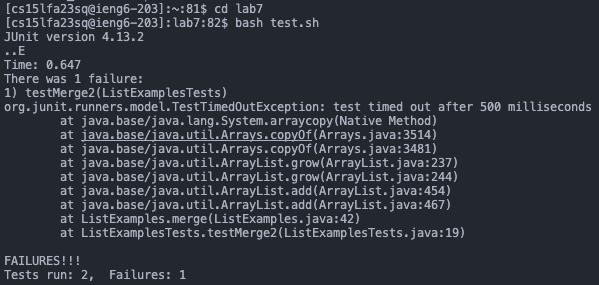
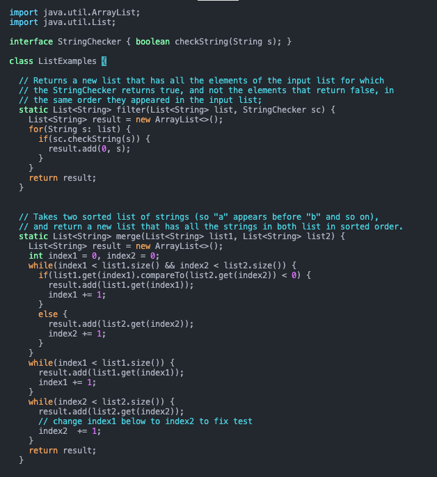
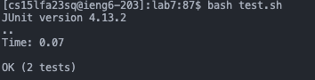
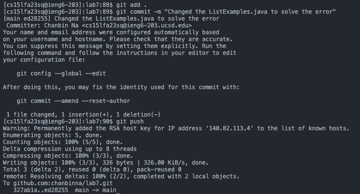

# Lab Report 4 - Vim (Week 7)

## 1. Log into ieng6
\
*Keys Pressed: I used the `ssh cs15lfa23sq@ieng6.ucsd.edu` which is my ieng login ID. As I already set the SSH keys so it doesn't requires me to type the password for it.*

---
## 2. Clone your folk of the repository from your Github account (using the SSH URL)
\
*Keys Pressed: I used `git clone git@github.com:chanbinna/lab7.git` command to clone the repository to my ieng6. The file here is folked to my Github account and now clone to my ieng6. I also use command `ls` to check whether the file is cloned well.*

---
## 3. Run the tests, demonstrating that they fail
\
*Keys Pressed: In here, I first used `cd lab7` to move into the directory. Then inside the directory, I ran the test.sh file with `bash test.sh` to run the test. Inside the test.sh, there is `javac -cp .:lib/hamcrest-core-1.3.jar:lib/junit-4.13.2.jar *.java
java -cp .:lib/hamcrest-core-1.3.jar:lib/junit-4.13.2.jar org.junit.runner.JUnitCore ListExamplesTests` commands that compiles and runs the test file called ListExamplesTests*

---
## 4. Edit the code file `ListExamples.java` to fix the failing test
\
(File after change)\
\
*Keys Pressed: First I used command `vim ListExamples.java` to open the vim java file. Then the file is opened as a vim. in a normal mode `/index1` and `<enter>` to search the index1 file that we want to change. Then press`<n><n><n><n><n><n><n><n><n>` 9 times to find the exact index1 that we want to make change. Then press `<w>` to move the curser to `+` in the code before we make any change. Then press `<i>` to enter to the insert mode, then `<backspace><backspace>` to delete the 1. Now type `2` to change 1 to 2 and `<spacebar>` to make the format proper. Then now `<esc>` to exit the insert mode. now `:wq` to save and exit the vim.*

---
## 5. Run the tests, demonstrating that they now succeed
\
*Key Pressed: Now if we do `bash test.sh` it shows that 2 tests are passed!*

---
## 6. Commit and push the resulting change to your Github account
\
*Key Pressed: In here, we first add the changes to the git by `git add .` and then use the command `git commit` to commit the file. Option `-m` allows us to type the message inside the terminal, like `-m "Changed the ListExample.java to solve the error` as I did. Then lastly I used `git push` to successfully push our changes to the git and Github repository in my account.*
