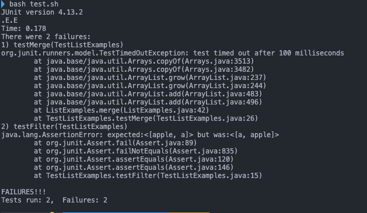
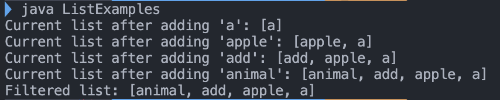
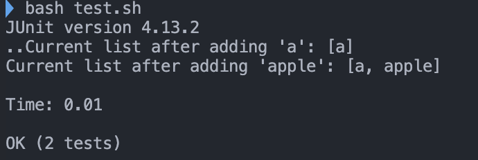

# Lab Report 5 - Putting it All Together (Week 9)

## Part 1 - Debugging Scenario

### 1. Post from a student showing symptom and a description of a guess at the bug/some sense of what the failure-inducing input is.

**Title:** Issue with `listExamples` Java Class - unexpected output in `filter` and `merge` method.

**Body:** \
Hello, I am working on a Java project involving a class `ListExamples` with two methods `filter` and `merge`. For file structure, in my directory, there is ListExamples.java, the main file that we want to check, JUnit test file TestListExamples.java, and test.sh that runs the test file. As the screenshot below, I ran the test.sh file that runs the test file, and got 2 error. The `filter` method is supposed to return a list containing elements that match a given condition, but the order seems wrong. For `merge` method, this method suppose to merge the two sorted lists, but it enters the infinite loop and produce error. 

Screenshot:


I guess for `filter` there could be issue on the way that I put in the list and for `merge` probabily I set some loop wrong if I am right?

---

### 2. A response from a TA asking a leading question or suggesting a command to try


**Response from TA:**

Hi, 

With the information that I have, I can just guess what kind of the error  you have. 

For the `filter` method, it seems like there is an issue with the order of insertion into the list that you are returning. Try to modify the code so that it adds the element at the end of the list that you are returning. 

For the `merge` method, it seems like one of the loop is prducing bug. Try to find the loop that produces the bug and look carefully of the change of variable if you use increment to see the change.

It would be also helpful if you also provide the code with the post. Also if you couldn't find the error on your own, I think adding the print inside the code to monitor the change could also help.

---

### 3. Another screenshot/terminal output showing what information the student got from trying that, and a clear description of what the bug is. 

**Follow-up by student:**

Thank you for the answer!\
This is the code that I had before.

```java
import java.util.ArrayList;
import java.util.List;

interface StringChecker {
  boolean checkString(String s);
}

class ListExamples {

  // Returns a new list that has all the elements of the input list for which
  // the StringChecker returns true, and not the elements that return false, in
  // the same order they appeared in the input list;
  static List<String> filter(List<String> list, StringChecker sc) {
    List<String> result = new ArrayList<>();
    for (String s : list) {
      if (sc.checkString(s)) {
        result.add(0, s);
      }
    }
    return result;
  }

  // Takes two sorted list of strings (so "a" appears before "b" and so on),
  // and return a new list that has all the strings in both list in sorted order.
  static List<String> merge(List<String> list1, List<String> list2) {
    List<String> result = new ArrayList<>();
    int index1 = 0, index2 = 0;
    while (index1 < list1.size() && index2 < list2.size()) {
      if (list1.get(index1).compareTo(list2.get(index2)) < 0) {
        result.add(list1.get(index1));
        index1 += 1;
      } else {
        result.add(list2.get(index2));
        index2 += 1;
      }
    }
    while (index1 < list1.size()) {
      result.add(list1.get(index1));
      index1 += 1;
    }
    while (index2 < list2.size()) {
      result.add(list2.get(index2));
      index1 += 1;
    }
    return result;
  }

}

```

In here, finding the error for the second one, the one from the merge method was pretty easy. as I see, for the last while loop, it is quite obvious that this index should be index2+= 1; so that it could add to index2 so that eventually it could end the loop, that is the only reason that could make the infinite loop. For the other part, first I was not sure what is the error here, so I added the print function so that I could track all the changes. 

```java
import java.util.ArrayList;
import java.util.Arrays;
import java.util.List;

interface StringChecker {
  boolean checkString(String s);
}

class ListExamples {

  public static void main(String[] args) {
    // Create a list of strings
    List<String> strs = new ArrayList<>();
    strs.add("a");
    strs.add("b");
    strs.add("apple");
    strs.add("add");
    strs.add("animal");

    // Filter the list with a condition (strings starting with 'a')
    List<String> filtered = ListExamples.filter(strs, s -> s.charAt(0) == 'a');

    // Print the filtered list
    System.out.println("Filtered list: " + filtered);
  }

  // Returns a new list that has all the elements of the input list for which
  // the StringChecker returns true, and not the elements that return false, in
  // the same order they appeared in the input list;
  static List<String> filter(List<String> list, StringChecker sc) {
    List<String> result = new ArrayList<>();
    for (String s : list) {
      if (sc.checkString(s)) {
        result.add(0, s);
        System.out.println("Current list after adding '" + s + "': " + result);
      }
    }
    return result;
  }

  // Takes two sorted list of strings (so "a" appears before "b" and so on),
  // and return a new list that has all the strings in both list in sorted order.
  static List<String> merge(List<String> list1, List<String> list2) {
    List<String> result = new ArrayList<>();
    int index1 = 0, index2 = 0;
    while (index1 < list1.size() && index2 < list2.size()) {
      if (list1.get(index1).compareTo(list2.get(index2)) < 0) {
        result.add(list1.get(index1));
        index1 += 1;
      } else {
        result.add(list2.get(index2));
        index2 += 1;
      }
    }
    while (index1 < list1.size()) {
      result.add(list1.get(index1));
      index1 += 1;
    }
    while (index2 < list2.size()) {
      result.add(list2.get(index2));
      index2 += 1;
    }
    return result;
  }

}
```

so here, I changed the merge method error and made the print function to track the filter method. 
 \
by running the java file here, we could definitely know that the filter method add the file to the front of the list not as we intended. So I checked the file where we add to the list, and found that `result.add(0, s);` might be the problem here. As I noticed that 0 inside the `.add` add the string to the front of the list, as I changed as `result.add(s)` this work well. So as I run the test again,

\
I passed all the test perfectly.

So my changed java file might be 

```java
import java.util.ArrayList;
import java.util.Arrays;
import java.util.List;

interface StringChecker {
  boolean checkString(String s);
}

class ListExamples {

  public static void main(String[] args) {
    // Create a list of strings
    List<String> strs = new ArrayList<>();
    strs.add("a");
    strs.add("b");
    strs.add("apple");
    strs.add("add");
    strs.add("animal");

    // Filter the list with a condition (strings starting with 'a')
    List<String> filtered = ListExamples.filter(strs, s -> s.charAt(0) == 'a');

    // Print the filtered list
    System.out.println("Filtered list: " + filtered);
  }

  // Returns a new list that has all the elements of the input list for which
  // the StringChecker returns true, and not the elements that return false, in
  // the same order they appeared in the input list;
  static List<String> filter(List<String> list, StringChecker sc) {
    List<String> result = new ArrayList<>();
    for (String s : list) {
      if (sc.checkString(s)) {
        result.add(s);
        System.out.println("Current list after adding '" + s + "': " + result);
      }
    }
    return result;
  }

  // Takes two sorted list of strings (so "a" appears before "b" and so on),
  // and return a new list that has all the strings in both list in sorted order.
  static List<String> merge(List<String> list1, List<String> list2) {
    List<String> result = new ArrayList<>();
    int index1 = 0, index2 = 0;
    while (index1 < list1.size() && index2 < list2.size()) {
      if (list1.get(index1).compareTo(list2.get(index2)) < 0) {
        result.add(list1.get(index1));
        index1 += 1;
      } else {
        result.add(list2.get(index2));
        index2 += 1;
      }
    }
    while (index1 < list1.size()) {
      result.add(list1.get(index1));
      index1 += 1;
    }
    while (index2 < list2.size()) {
      result.add(list2.get(index2));
      index2 += 1;
    }
    return result;
  }

}
```

## Part 2 - Reflection
For this half of the other labs, I think I learned so many different things that could be helpful in the future. All the thechniques that I learned from  this lab seems like that I will use in some point (probabily not vim??). For the week 6 to 10, we learned matarials like scripting some bash files, bash syntax, vim, and jdb. It was so cool that we can actually do all the job on terminal using all those vim and jdb, editing the file and java debugging, and seems especially useful when we will use servers or remote computers. Also, bash seems really useful too, as it could be used as automating lots of process, some system adminstration jobs, grading process as we useed in the `grade.sh`, and lots other way. While doing the labs, restricting ourself only into the terminal was quite challenging when we did it for the first time, but as we were keep doing it, it became much more comfortable and in some way it could be used more efficiently too. So all the skills that I learned from this lab, especially for the ones on the last half, were really useful and feel like I will be using it later a lot.

